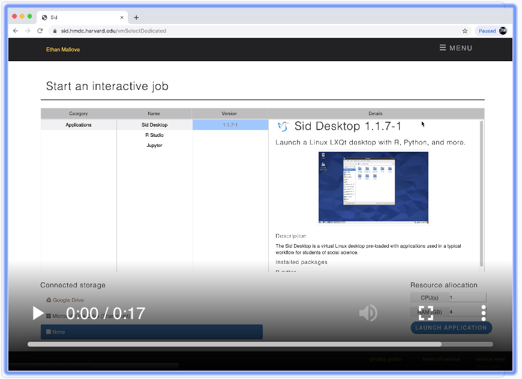
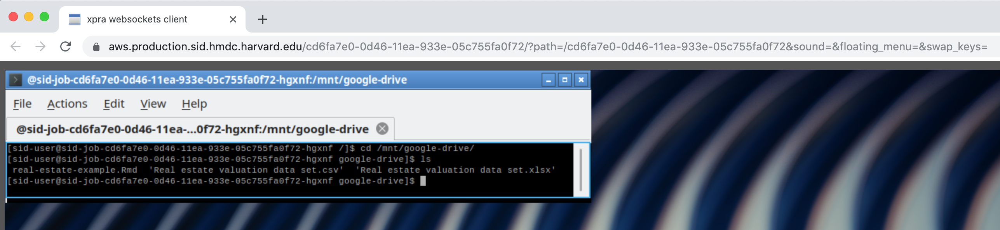
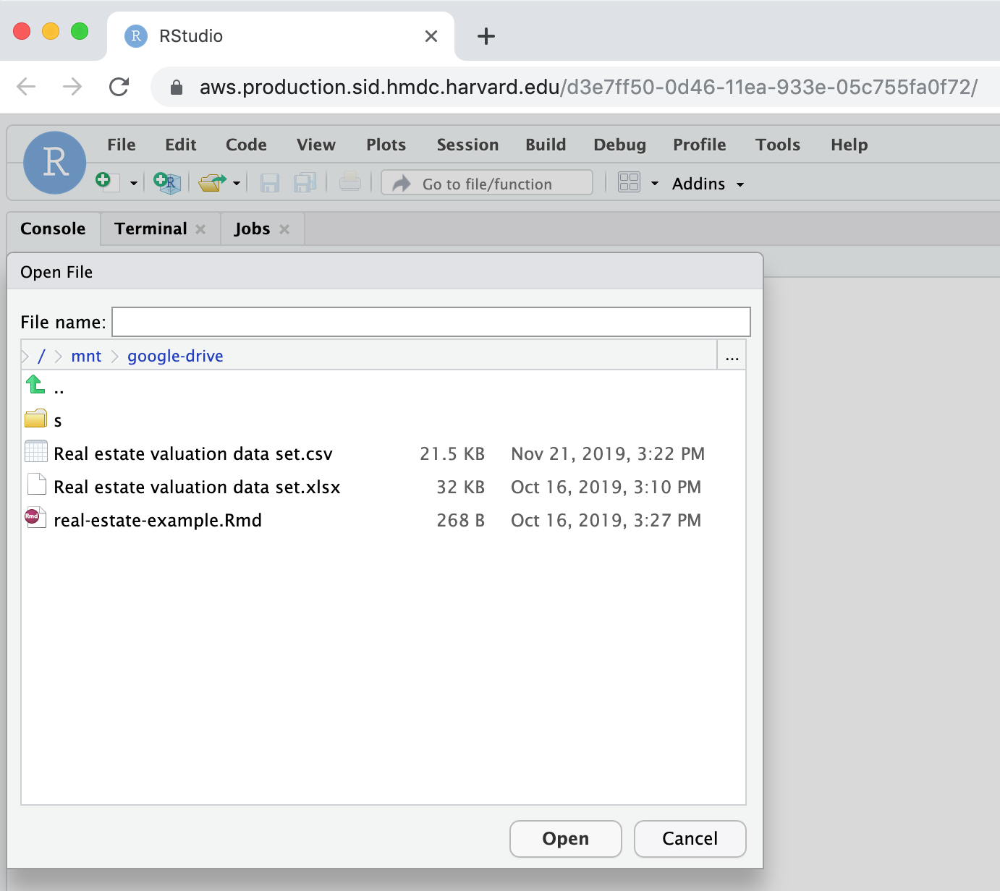
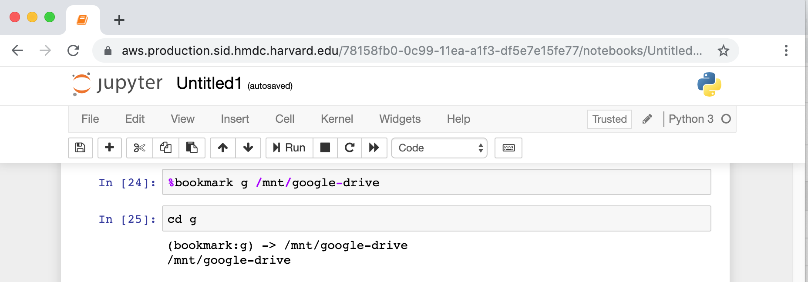
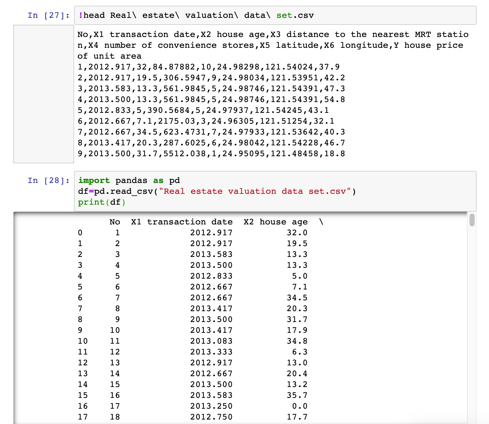
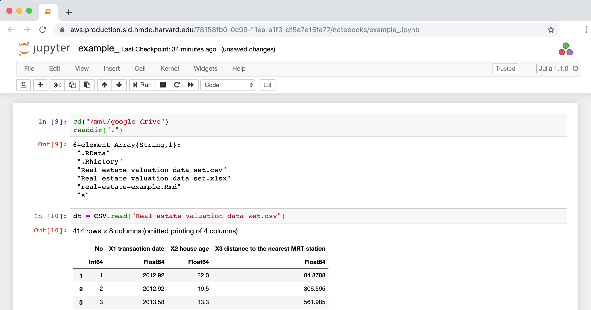
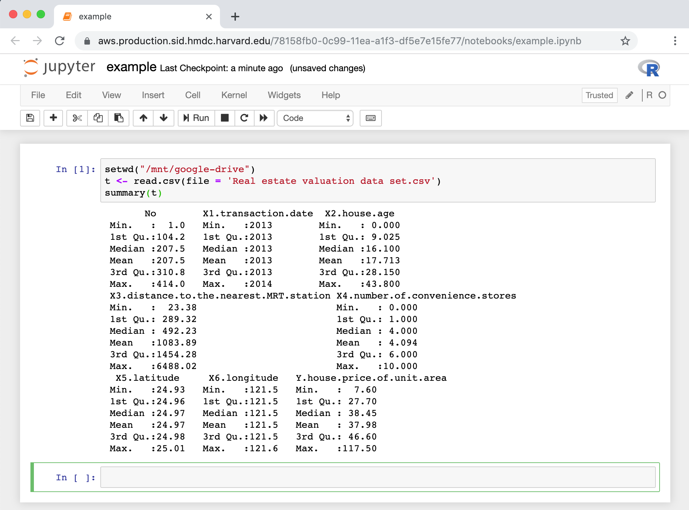
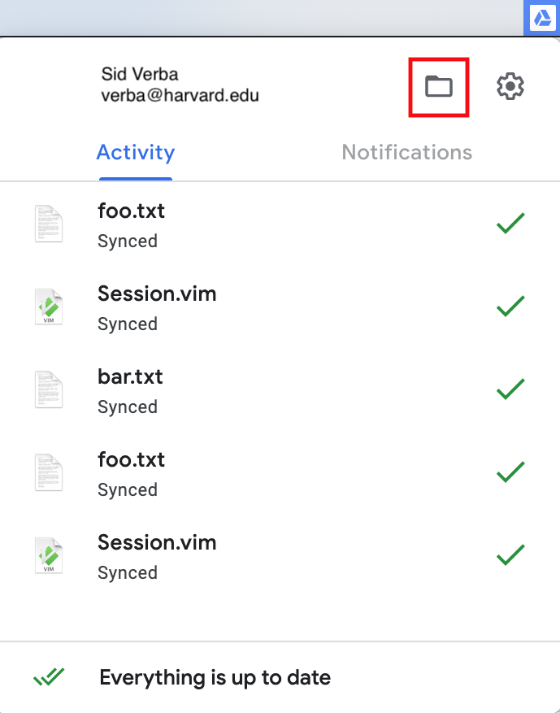
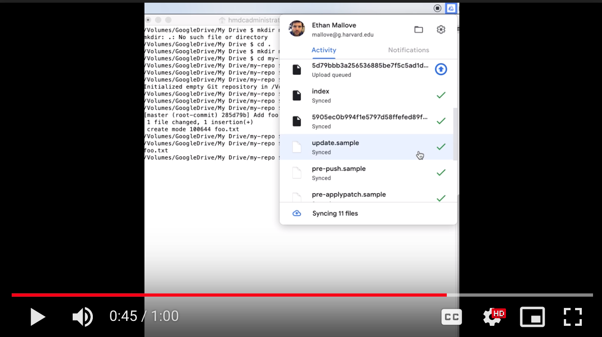

# FAQ

## What is my Sid username and password?

Your Sid credentials are your [HarvardKey](https://key.harvard.edu) e-mail address and password.

## Can I FTP files between Sid and my local computer using FileZilla or some other FTP program?

No. Please use [Google Drive](http://drive.google.com) to transfer data into and out of your Sid session.

## How do I run a batch job?

Sid will support [classical batch-style processing](https://en.wikipedia.org/wiki/Batch_processing) in a [future release](https://github.com/hmdc/sid/issues?utf8=✓&q=is%3Aissue+is%3Aopen++batch). Currently, batch-style jobs can run indefinitely in the background _without user input_ within an [interactive job](https://www.sid.hmdc.harvard.edu/vmSelectDedicated).

## How do I read a network file in R?

Use the [`httr`](https://www.rdocumentation.org/packages/httr/versions/1.4.1) [`GET`](https://www.rdocumentation.org/packages/httr/versions/1.4.1/topics/GET) function, e.g.,

```text
library(httr)

# Example World Health data
url <- 'https://pastebin.com/raw/V7DEMiDu';
r <- GET(url)
fil <- tempfile("data")
write(content(r, "text"), fil)
WHS_data <- read.table(fil, sep="\t", header=TRUE, quote="")

summary(WHS_data[,c(1,4,10)])
pairs(WHS_data[,c(1,4,10)])
```

## How much \[ephemeral\] storage does my job have?

Use [`df`](https://linux.die.net/man/1/df) `-h` to display disk size. E.g., in the below example, the job has `92G` of disk storage under `Avail`.

```text
$ df -h $HOME
Filesystem      Size  Used Avail Use% Mounted on
overlay         105G   14G   92G  14% /
```

## How do I cut and paste to and from my Sid Desktop?

Select `Site Settings`in your Sid Desktop browser tab:


Select `Clipboard` -&gt; `Allow`


Different operating systems and keyboard configurations map copy and paste differently; but it is generally one of Ctrl-C, Option-C, Alt-C, or ⌘-C for copy \(and Ctrl-V, Option-V, Alt-V, or ⌘-V for paste\).

## How do I connect my Google Drive to my Sid Job?

In the [job launcher](https://www.sid.hmdc.harvard.edu/vmSelectDedicated), select `Google Drive` under `Connected Storage`:


[Screencast](https://drive.google.com/a/harvard.edu/file/d/1rATyzrZh17xwjT_bkg88xQEKw_2v_45m/view?usp=sharing) for a demonstration of attaching a Google Drive to a Sid job:

[](https://drive.google.com/a/harvard.edu/file/d/1rATyzrZh17xwjT_bkg88xQEKw_2v_45m/view?usp=sharing)

## Will requesting more resources slow my job's performance?

No. A CPU is a CPU and RAM is RAM. Sid does not allocate _cheaper_, worse-performing hardware based on request size. Additionally, running multiple jobs will not degrade performance. Sid users can run up to eleven jobs without any performance degradation \(as each is allocated dedicated resources from AWS\).

## How do I launch an app from the Sid Dashboard?

When Sid has completed provisioning your desktop environment, a link to it will appear below `Access Url` in the dashboard:


The Sid Desktop runs LxQT, [The Lightweight Qt Desktop Environment](https://lxqt.org/). Like all desktop environments, the left-hand corner opens a menu of useful GUI X Windows applications including web browsers, terminal emulators, text editors, LaTeX editors, and more.

### System Tools

[QTerminal](http://manpages.ubuntu.com/manpages/bionic/en/man1/qterminal.1.html) is available under System Tools. It is a multi-tab terminal emulator, which can run command-line applications.


### Education

GNU Octave is a free alternative to [MATLAB](https://www.mathworks.com/products/matlab.html) available in the Education menu.


### Office

[LyX](https://www.lyx.org) and [TeXstudio](https://github.com/hmdc/gitbook/tree/2a1870281587e9ecaf6f1067c2f2eb2859803c63/www.texstudio.org) are LaTeX authoring tools for academic papers.


### Programming

[Emacs](https://www.gnu.org/software/emacs/) is a popular text editor available in the Programming menu.


### Internet

The [Firefox](https://www.mozilla.org/en-US/firefox/) browser is available in the Internet menu.


## What command-line tools are available in the Sid Desktop?

The Sid Desktop has hundreds of commands pre-installed such as the following:

```text
R
docbook
emacs
gcc
git
gnuplot
imageMagick
java
lua
make
octave
perl
python2
python3
rpm
rxvt
screen
tcl
texlive
texstudio
tix
tk
tmux
vim
zip
```

The [YUM package manager](http://yum.baseurl.org/) can list, query, and add additional command-line tools to the Sid Desktop.

## How do I access my Google Drive files?

For all applications, Sid mounts your Google Drive to the same location: `/mnt/google-drive`. Each Sid application has similar commands for navigating to this directory location.


Google Drive in Sid does not currently support [symbolic links](http://man7.org/linux/man-pages/man1/ln.1.html).


### Desktop

From [QTerminal](https://hmdc.gitbook.io/sid/faq#system-tools),[`cd`](http://linuxcommand.org/lc3_man_pages/cdh.html) to your Google Drive's mount point:



Start your application \(e.g., [`R`](https://www.r-project.org/about.html)\) and access your Google Drive data files:


### RStudio

[`setwd`](https://stat.ethz.ch/R-manual/R-devel/library/base/html/getwd.html) to the attached Google Drive:


Your Google Drive files are now visible from the `File`-&gt;`Open` menu:



### Jupyter

#### Python 3

From within a Python Notebook,[`cd`](https://ipython.readthedocs.io/en/stable/interactive/magics.html#magic-cd) \(or [`%bookmark`](https://ipython.readthedocs.io/en/stable/interactive/magics.html#magic-bookmark)\) to the mount point for your Google Drive:



You are now in your Google Drive's working directory for reading data, e.g.,



#### Julia

From within a Julia Notebook,[`cd`](https://docs.julialang.org/en/v1/base/file/#Base.Filesystem.cd-Tuple{AbstractString})to the mount point for your Google Drive:



#### R

From within an R Notebook, [`setwd`](https://www.rdocumentation.org/packages/base/versions/3.6.1/topics/getwd) to the mount point for your Google Drive:



## How do I manage my Git repository in Google Drive?

Are you sure you don't want to use a Git hosting provider such as [GitHub](http://github.com), [BitBucket](https://bitbucket.org/), or [BeanStalk](https://beanstalkapp.com/)? If not, open the directory of your Google Drive File Stream:



From inside your Google Drive directory, you can use standard `git` commands, and all of the git metadata in your repository will be synced in Google Drive, e.g.,

```text
/Volumes/GoogleDrive/My Drive/my-repo $ git init
Initialized empty Git repository in /Volumes/GoogleDrive/My Drive/my-repo/.git/
/Volumes/GoogleDrive/My Drive/my-repo $ echo 1 2 3 > foo.txt
/Volumes/GoogleDrive/My Drive/my-repo $ git add foo.txt
/Volumes/GoogleDrive/My Drive/my-repo $ git commit -m "Add foo.txt"
[master c947c83] Add foo.txt
 1 file changed, 1 insertion(+)
 create mode 100644 foo.txt
/Volumes/GoogleDrive/My Drive/my-repo $
```


Warning: you can not run `git` commands of any kind on your Git/Drive repository from within Sid due to limitations of [rclone](https://rclone.org/).



Google Drive File Stream will only connect to Google Drive accounts that are part of an enterprise G Suite \(for example g.harvard.edu\). If you need assistance with accessing Google Drive using some other method you can [contact us for support](mailto:support@help.hmdc.harvard.edu).


[Screen cast](https://drive.google.com/a/harvard.edu/file/d/160zGjiOXAoKvTFNU-uLFPauUioGSueA2) showing Git + Google Drive workflow:

[](https://drive.google.com/a/harvard.edu/file/d/160zGjiOXAoKvTFNU-uLFPauUioGSueA2)

## Is Google Drive essentially a POSIX-compatible file system?

[Google Drive in Sid](https://hmdc.gitbook.io/sid/faq#how-do-i-access-my-google-drive-files) is an [object storage](https://en.wikipedia.org/wiki/Object_storage) system synced by [rclone](https://rclone.org/) to resemble a file system, but it is lacking some features of a standard [POSIX](https://en.wikipedia.org/wiki/POSIX) [file system](https://en.wikipedia.org/wiki/File_system#Unix_and_Unix-like_operating_systems) \(such as [symbolic links](https://en.wikipedia.org/wiki/Symbolic_link#POSIX_and_Unix-like_operating_systems) and [file permissions](https://en.wikipedia.org/wiki/File_system_permissions#Traditional_Unix_permissions)\).

Because the features of Google Drive in Sid are not at parity with some POSIX file systems, you may encounter the following problems:

### Unexpected File Modifications in Version Control

File modifications between Git and Google Drive may disagree, so for example:

```text
$ git status
Your branch is up to date with 'origin/master'.
nothing to commit, working tree clean
```

The same directory used in Google Drive shows modifications to a file in Git:

```text
$ git status
Changes not staged for commit:
  (use "git add <file>..." to update what will be committed)
  (use "git restore <file>..." to discard changes in working directory)
	modified:   foo
```

The above discrepancy is due to the different handling of file permissions:

Non-Google drive:

`-rwxr-xr-x 1 jane staff 6991 Nov 25 17:04 foo`

Google drive \(note the differing [file permissions](https://en.wikipedia.org/wiki/File_system_permissions#Traditional_Unix_permissions)\):

`-rw------- 1 jane staff 6991 Nov 25 17:05 foo`

### Un-runnable Scripts

Running a script from Google Drive can cause `bad interpreter: Permission denied` errors.  For example, the below code runs fine in `$HOME`:

```text
$ cat hello.sh
!/usr/bin/bash
echo "hello" 
$ ./hello.sh 
hello
```

The same code fails in Google Drive with `bad interpreter: Permission denied`:

```text
$ cat /mnt/google-drive/hello.sh
#!/usr/bin/bash
echo "hello"
$ /mnt/google-drive/hello.sh
sh: /mnt/google-drive/hello.sh: /usr/bin/bash: bad interpreter: Permission denied
```

